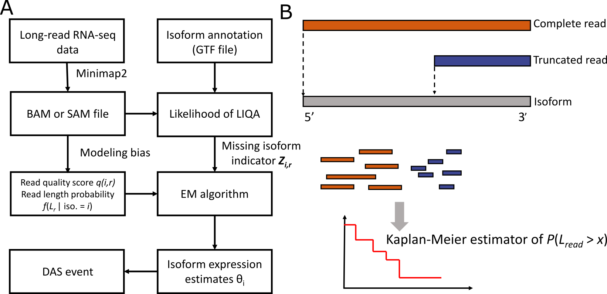

# Long-read Isoform Quantification and Analysis
A statistical tool to quantify isoform-specific expression using long-read RNA-seq

## Computational pipeline of LIQA

  

## Inputs of LIQA
The input of LIQA is single-cell RNA-seq read data in BAM format together with a refrence isoform annotation file.

## Installation
Please refer to [Installation](https://github.com/WGLab/LIQA/blob/master/doc/Install.md) for how to install LIQA.

## Usage
Please refere to [Usage](https://github.com/WGLab/LIQA/blob/master/doc/Usage.md) for how to use LIQA.

## Contact

If you have any questions/issues/bugs, please post them on [GitHub](https://github.com/WGLab/LIQA/issues). They would also be helpful to other users. 

